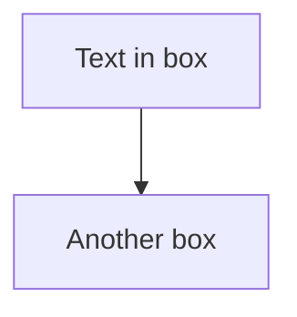

# Architecture Diagrams - Quick Start Guide

## 📊 Overview

This project includes **5 comprehensive architecture diagrams** that visualize different aspects of the German Credit Scorecard system. All diagrams are created using **Mermaid**, a JavaScript-based diagramming tool.

**Files Included:**
- `1_detailed_system_architecture.mmd` - Complete 7-layer architecture
- `2_component_interaction.mmd` - How components communicate
- `3_deployment_architecture.mmd` - Development to production pipeline
- `4_data_flow.mmd` - Step-by-step data transformations
- `5_components_dependencies.mmd` - Technical modules and dependencies

---

## 🖼️ How to View & Convert Diagrams

### **Option 1: Online Mermaid Editor (Easiest - No Installation) ⭐**

**Best for:** Quick viewing and downloading PNG files

1. **Open Mermaid Live Editor**
   - Visit: https://mermaid.live
   - Or: https://mermaid-js.github.io/mermaid-live-editor/

2. **For Each Diagram:**
   - Open the `.mmd` file in your text editor (Notepad, VS Code, etc.)
   - Copy all the content (Ctrl+A, Ctrl+C)
   - Paste into Mermaid Live Editor
   - Click the **Download** button (⬇️ icon at the top)
   - Select **PNG** format
   - File will download automatically

3. **Save Downloaded Files**
   - Place PNG files in your project folder for easy access

---

### **Option 2: Using Python Script**

**Installation:**
```bash
pip install requests
```

**Usage:**
```bash
python convert_diagrams_to_png.py
```

**What it does:**
- Automatically finds all `.mmd` files
- Attempts conversion using multiple online services
- Saves PNG files in the same directory

**Note:** Requires internet connection

---

### **Option 3: Using Command-Line Tools**

**Install Node.js and Mermaid CLI:**

```bash
# Option A: Using npm (Node.js Package Manager)
npm install -g @mermaid-js/mermaid-cli

# Option B: Using Homebrew (Mac)
brew install mermaid-cli
```

**Convert diagrams:**
```bash
mmdc -i 1_detailed_system_architecture.mmd -o 1_detailed_system_architecture.png
mmdc -i 2_component_interaction.mmd -o 2_component_interaction.png
mmdc -i 3_deployment_architecture.mmd -o 3_deployment_architecture.png
mmdc -i 4_data_flow.mmd -o 4_data_flow.png
mmdc -i 5_components_dependencies.mmd -o 5_components_dependencies.png
```

---

### **Option 4: Online Conversion Tools**

**Kroki.io:**
- Visit: https://kroki.io/
- Select "Mermaid" from dropdown
- Paste diagram code
- Click "Convert"
- Download as PNG

**Mermaid.ink:**
- Visit: https://mermaid.ink/
- Follow on-screen instructions
- Automatic PNG generation

---

## 📋 Diagram Descriptions

### **1. Detailed System Architecture** 📐
**File:** `1_detailed_system_architecture.mmd`

**What it shows:**
- All 7 system layers (Data → Output)
- Data flow through the pipeline
- Component relationships

**Best for:** 
- Understanding the complete system
- High-level project overview
- Presentations to stakeholders

**Key layers:**
1. Data Layer (3 datasets)
2. Preprocessing & Feature Engineering
3. Model Layer (4 models)
4. Evaluation Layer
5. Scorecard Layer
6. Application Layer (Flask)
7. Output Layer (Visualizations)

---

### **2. Component Interaction** 🔗
**File:** `2_component_interaction.mmd`

**What it shows:**
- How each component communicates
- Data exchange between modules
- Request/response flows

**Best for:**
- System integration
- API design understanding
- Component dependency analysis

**Key interactions:**
- Client ↔ Flask Server
- Processing Engine ↔ Data Store
- ML Pipeline ↔ Visualization

---

### **3. Deployment Architecture** 🚀
**File:** `3_deployment_architecture.mmd`

**What it shows:**
- Development environment setup
- Training pipeline execution
- Production deployment options

**Best for:**
- DevOps and infrastructure planning
- Deployment strategy
- Environment configuration

**Key environments:**
- Local Development
- Training Pipeline
- Version Control (Git/GitHub)
- Production Ready (Docker, Gunicorn, Nginx)

---

### **4. Data Flow** 💧
**File:** `4_data_flow.mmd`

**What it shows:**
- Step-by-step data transformations
- From raw data to predictions
- Training and runtime scoring flows

**Best for:**
- Understanding feature engineering
- Model training visualization
- Data science presentations

**Key stages:**
- Input: 3 datasets (2,380 records)
- Integration & Quality Control
- Train/Test Split (70/30)
- Feature Engineering (WOE/IV)
- Model Training & Evaluation
- Scorecard Generation
- Runtime Scoring

---

### **5. Components & Dependencies** ⚙️
**File:** `5_components_dependencies.mmd`

**What it shows:**
- Technical module structure
- Function dependencies
- System components breakdown

**Best for:**
- Developers and maintainers
- Code organization understanding
- Debugging and troubleshooting

**Key modules:**
- Data Sources
- Preprocessing Module
- Feature Engineering
- Model Components
- Evaluation Module
- Scorecard Module
- Visualization Module
- Application Layer
- Utilities

---

## 🎨 Diagram Features

All diagrams include:
- ✅ Color-coded sections for easy identification
- ✅ Emoji icons for quick visual reference
- ✅ Key metrics and parameters
- ✅ Data volumes and percentages
- ✅ Clear flow directions and relationships

---

## 📖 Common Tasks

### **Task: Add diagram to research paper**
1. Convert diagram to PNG using Option 1 (Mermaid Live)
2. Insert PNG into your paper
3. Add caption (see `ARCHITECTURE_DIAGRAMS.md` for suggested captions)
4. Reference in text

### **Task: Share diagram with team**
1. Export to PNG
2. Upload to shared drive/email
3. Or: Share `.mmd` file (team can view in Mermaid Live)

### **Task: Modify diagram**
1. Open `.mmd` file in text editor
2. Edit Mermaid syntax (see references below)
3. Save file
4. Preview in Mermaid Live
5. Export to PNG when satisfied

### **Task: Create higher resolution PNG**
1. Use Mermaid CLI with additional parameters:
```bash
mmdc -i diagram.mmd -o diagram.png --width 2000 --height 1500
```

---

## 🔗 Useful Links

**Official Mermaid Documentation:**
- https://mermaid-js.github.io/mermaid/

**Mermaid Syntax Guide:**
- https://mermaid-js.github.io/mermaid/#/syntax

**Mermaid Live Editor:**
- https://mermaid.live

**Diagram Tools:**
- Kroki: https://kroki.io/ (renders multiple formats)
- Mermaid Ink: https://mermaid.ink/
- PlantText: https://www.planttext.com/

---

## 🛠️ Troubleshooting

### **Issue: "Cannot find mermaid-cli"**
- **Solution:** Install Node.js from https://nodejs.org/
- Then: `npm install -g @mermaid-js/mermaid-cli`

### **Issue: Online converter returns error**
- **Solution:** Try a different online tool (Kroki → Mermaid.ink → PlantText)
- The diagram might be too large; try simplifying it

### **Issue: PNG not downloading from Mermaid Live**
- **Solution:** Try different browser or private/incognito mode
- Check browser download settings

### **Issue: Text too small in PNG**
- **Solution:** Use Mermaid CLI with width/height parameters:
  ```bash
  mmdc -i diagram.mmd -o diagram.png --width 3000 --height 2000
  ```

---

## 📝 Mermaid Syntax Quick Reference

**Basic shape:**


**Styled subgraph:**
```mermaid
subgraph MyGroup["Group Label"]
    A["Component A"]
    B["Component B"]
end
```

**Styled arrow:**
```mermaid
A -->|Label| B
A -->|Another label| C
```

---

## 🎯 Next Steps

1. **View diagrams** using Option 1 (Mermaid Live)
2. **Convert to PNG** for your paper/presentation
3. **Share `.mmd` files** with team for collaborative editing
4. **Reference diagrams** in your project documentation

---

## 📧 Support

For issues or questions about the diagrams:
1. Check Mermaid documentation: https://mermaid-js.github.io/
2. Try alternative conversion methods
3. Refer to `SYSTEM_ARCHITECTURE.md` for detailed descriptions

---

**Last Updated:** April 20, 2026  
**Format:** Mermaid Diagram Markup (.mmd)  
**Tools:** Mermaid.js, Kroki, Python conversion scripts  
**License:** Same as project (MIT/GitHub)
